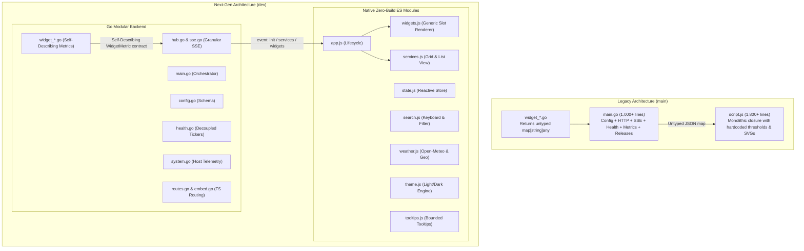

# Simple Dash Next-Generation Architecture Report (`dev` branch)

## Executive Overview
The **`dev`** branch of Simple Dash represents a foundational architectural evolution. While preserving **100% of the visual styling, glassmorphism design, compositor animations, and feature set**, the codebase has been transformed from monolithic scripts into a modern, decoupled, and maintainable architecture.

---

## Key Changes & Architectural Comparison



---

## 1. Decoupled, Self-Describing Backend Widgets

### The Change
* Replaced the loose `map[string]interface{}` widget parser return type with a strongly typed **`WidgetMetric` contract** in [`widget_utils.go`](widget_utils.go):
  ```go
  type MetricThreshold struct {
      Warning  float64 `json:"warning,omitempty"`
      Danger   float64 `json:"danger,omitempty"`
      Inverted bool    `json:"inverted,omitempty"`
  }

  type WidgetMetric struct {
      Key       string           `json:"key"`
      Label     string           `json:"label"`
      Value     interface{}      `json:"value"`
      Formatted string           `json:"formatted"`
      Unit      string           `json:"unit,omitempty"`
      Icon      string           `json:"icon,omitempty"`
      Threshold *MetricThreshold `json:"threshold,omitempty"`
  }
  ```
* Refactored all 9 built-in service widgets (`blocky`, `homeassistant`, `jellyfin`, `pihole`, `portainer`, `proxmox`, `qbittorrent`, `speedtest`, `system`) to implement this contract.

### The Benefits
* **Zero Frontend Modification for New Widgets:** Previously, adding a widget required writing Go code *and* manually updating `getMetricIcon` and `getWidgetMetricColours` in JavaScript. Now, the Go parser defines labels, units, icons, display order, and threshold scales.
* **Deterministic Display Order:** Go slices preserve ordered presentation, eliminating hardcoded metric key sorting in the client.

---

## 2. Zero-Build Native ES Modules

### The Change
* Decomposed the monolithic 1,800-line `script.js` into focused, browser-native ES modules loaded via `<script type="module" src="js/app.js">`:
  * [`static/js/app.js`](static/js/app.js): Application bootstrap and coordination.
  * [`static/js/state.js`](static/js/state.js): Reactive store with event-driven change notifications.
  * [`static/js/sse.js`](static/js/sse.js): EventSource connection handling typed events (`init`, `services`, `widgets`, `config_reload`).
  * [`static/js/components/services.js`](static/js/components/services.js): Grid and list layout rendering, 3D card tilt, pinned items, and category hue gradients.
  * [`static/js/components/widgets.js`](static/js/components/widgets.js): Generic self-describing metric renderer with slot-machine animations (`animateMetric`).
  * [`static/js/components/weather.js`](static/js/components/weather.js): Open-Meteo client, IP geolocation, animated weather icons, and 1-second precision clock.
  * [`static/js/components/theme.js`](static/js/components/theme.js): Light/dark theme toggle engine and logo switcher.
  * [`static/js/components/search.js`](static/js/components/search.js): Real-time search filtering, `/` shortcut listener, and arrow key grid navigation.
  * [`static/js/components/tooltips.js`](static/js/components/tooltips.js): Viewport-bounded tooltips and responsive mobile menu.

### The Benefits
* **Strict Scope Isolation:** Eliminates variable collision, scope pollution, and state confusion.
* **Zero Build Step:** 100% compliant with the project's zero-external-dependency rule—no Node.js, Webpack, or Vite required in production.
* **Maintainability & Testability:** Each component can be modified and validated independently using `node --check`.

---

## 3. Backend Modularisation (`package main`)

### The Change
* Partitioned [`main.go`](main.go) from 1,001 lines down to ~60 lines, distributing responsibilities across dedicated files:
  * [`config.go`](config.go): YAML parsing, validation, and defaults injection.
  * [`system.go`](system.go): Telemetry parser (`/proc/stat`, `/proc/meminfo`, `/proc/uptime`).
  * [`hub.go`](hub.go): Thread-safe SSE client hub.
  * [`sse.go`](sse.go): SSE HTTP stream endpoint supporting typed events.
  * [`health.go`](health.go): Service health checks and widget polling.
  * [`watcher.go`](watcher.go): `fsnotify` file watcher with debounce.
  * [`releases.go`](releases.go): GitHub release cache and rate-limiting.
  * [`routes.go`](routes.go): HTTP router, gzip pool, and CSP headers.
  * [`embed.go`](embed.go): Standard library `embed.FS` integration.

### The Benefits
* Single Responsibility Principle applied across the entire Go backend.
* Retains single-binary static compilation with zero runtime footprint increase (< 20MB RSS).

---

## 4. Granular SSE Streaming & Decoupled Polling Cadences

### The Change
* Decoupled health monitoring into two distinct cadences:
  * **Fast Telemetry (10s ticker):** System metrics (CPU, RAM, Uptime) and active download speeds poll frequently to keep gauges fresh.
  * **Health Probing (60s ticker):** External HTTP service pings run at a 60-second interval to avoid network spam and respect remote rate limits.
* Introduced typed SSE events:
  * `event: init`: Complete initial state on client connect.
  * `event: services`: Pushed only when service reachability/latency updates.
  * `event: widgets`: Pushed when widget metrics refresh.
  * `event: config_reload`: Dispatched on `data/config.yaml` modifications.

### The Benefits
* Significant CPU and bandwidth savings for both host and clients.
* Faster, more responsive telemetry updates without increasing service ping overhead.

---

## 5. CSS Cascade Predictability with Native `@layer`

### The Change
* Structured [`static/style.css`](static/style.css) into standard CSS layers:
  ```css
  @layer theme, reset, base, components, layouts, utilities;
  ```

### The Benefits
* Completely eliminates specificity wars and accidental cascade overrides when adding or editing component styles.
* Supported natively in all modern browsers without CSS preprocessors.

---

## 6. Deprecation Tracking & Clean Cutting-Edge Schema

### The Change
* Removed legacy backward-compatibility shims (`show_sys_metrics` synthesis and nested `service.widget` synthesis) from the `dev` branch.
* Added Rule 5 to [`.agents/AGENTS.md`](.agents/AGENTS.md) mandating that any deprecated functionality be recorded in [`DEPRECATED.md`](DEPRECATED.md).
* Created [`DEPRECATED.md`](DEPRECATED.md) documenting legacy items and migration paths.
* Cleaned [`data/config.example.yaml`](data/config.example.yaml) and updated [`README.md`](README.md).

---

## 7. CI/CD for the `:dev` Container Tag

### The Change
* Updated [`.github/workflows/docker-dev.yml`](.github/workflows/docker-dev.yml) to trigger on pushes to the `dev` branch and build multi-arch images (`linux/amd64`, `linux/arm64`) published to GitHub Container Registry under `:dev` (`ghcr.io/buzzmoody/simple-dash:dev`).
* Updated [`.github/workflows/test.yml`](.github/workflows/test.yml) to execute Go tests, vet, and race detector on `dev`.

---

## Verification & Quality Results

| Test / Check | Command | Result |
| :--- | :--- | :--- |
| **Go Test Suite (Race Detector)** | `go test -count=1 -v -race ./...` | **PASS (1.015s)** |
| **Go Code Quality & Vet** | `go vet ./...` | **Clean (0 issues)** |
| **Go Code Formatting** | `gofmt -w .` | **Clean** |
| **Go Compilation** | `go build -o dash .` | **Clean (Single portable binary)** |
| **JavaScript Syntax Check** | `node --check static/js/**/*.js` | **Clean (0 errors across 9 modules)** |
| **Live Server Verification** | Embedded HTTP + SSE test | **200 OK across all routes & SSE events** |
