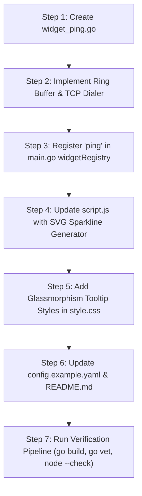

# Implementation Plan: Multi-Endpoint Latency & Game Server Sparkline Widget

**Project:** Simple Dash (`BuzzMoody/Simple-Dash`)  
**Feature Name:** Multi-Endpoint External Latency & Sparkline Monitor  
**Target Files:** `widget_ping.go`, `main.go`, `static/script.js`, `static/style.css`, `data/config.example.yaml`, `README.md`  
**Compliance Standard:** `AGENTS.md` (Rules 1–17)  
**Language Standard:** Australian English  

---

## Executive Summary & Technical Feasibility

### Is this possible?
**Yes, absolutely.** This feature is 100% technically feasible and fits seamlessly into Simple Dash's architecture. 

By leveraging Go's standard library `net.DialTimeout` for concurrent TCP/HTTP network probing alongside Vanilla JavaScript's DOM and inline SVG APIs (`document.createElementNS`), we can deliver a high-performance external latency monitor with zero third-party dependencies.

```
+-------------------------------------------------------------------------+
|                              SERVICE CARD                               |
|  [ Icon ]  Cloudflare & Game Nodes                                      |
|            Ping: 14 ms  (Slot-machine animated & colour-graded)         |
+-------------------------------------------------------------------------+
                                    |
                          (Hover / Expand Tooltip)
                                    v
+-------------------------------------------------------------------------+
|                         TOOLTIP BREAKDOWN                               |
|  1.1.1.1 (Cloudflare)   12 ms  [||||||||||||] (12-bar SVG Sparkline)     |
|  8.8.8.8 (Google DNS)   18 ms  [||||||||||||]                           |
|  CS2 EU (203.0.113.5)   42 ms  [||||||||||||]                           |
|  Minecraft Server       28 ms  [||||||||||||]  ⚡ Fastest                |
+-------------------------------------------------------------------------+
```

---

## Architecture Alignment & AGENTS.md Compliance Matrix

| Rule | Requirement | How This Feature Complies |
| :--- | :--- | :--- |
| **Rule 1: Efficiency & Polling** | Polling $\ge 5\text{s}$, bounded concurrency | Default polling interval of 15 seconds. Uses bounded channel semaphore (`chan struct{}`) limiting parallel dials to max 5 concurrent routines with a 2-second timeout per endpoint. |
| **Rule 2: High-Performance Animations** | Compositor-only CSS (`transform`, `opacity`) | Tooltip popovers and sparkline hover states use hardware-accelerated `opacity` and `transform` scale/translate. Zero layout reflow properties (`height`/`margin`) are animated. |
| **Rule 3: Zero-Dependency Policy** | Standard library Go & Vanilla JS | Network probing built using Go `net`, `time`, and `sync`. Sparklines rendered using native browser SVG DOM elements (`<svg>`, `<rect>`). No Chart.js or external Go packages required. |
| **Rule 5: Backward-Compatibility** | Safe defaults | If optional endpoint lists are omitted, defaults gracefully to Cloudflare (`1.1.1.1`) and Google (`8.8.8.8`). |
| **Rule 10: Security & XSS** | Escaping & DOM safety | Endpoint labels and host strings rendered strictly via `textContent` and `setAttribute`. No string concatenation into `innerHTML`. |
| **Rule 11: Australian English** | Spelling conventions | All documentation, comments, and identifiers use Australian English ("colour", "optimise", "categorise", "sanitise"). |
| **Rule 17: Metric Animations** | Slot-machine & metric colours | Latency metrics integrated into `getWidgetMetricColours` (Green $<30\text{ms}$, Yellow $30\text{--}80\text{ms}$, Orange $80\text{--}150\text{ms}$, Red $>150\text{ms}$) and `animateMetric`. |

---

## Proposed Configuration Schema (`config.yaml`)

Users can attach the latency monitor widget to any service card and define arbitrary target endpoints, hostnames, or specific TCP ports (e.g. game servers, SSH, web services):

```yaml
services:
  - name: "Network & Game Ping"
    url: "http://1.1.1.1"
    category: "Infrastructure"
    icon: "⚡"
    description: "External DNS & Game Server Latency Monitor"
    widget:
      type: "ping"
      settings:
        endpoints: "Cloudflare:1.1.1.1, Google DNS:8.8.8.8, CS2 EU:203.0.113.5:27015, Minecraft:mc.example.com:25565"
        timeout: "2s"
        primary: "Cloudflare"
```

### Options:
* `widget.type`: Set to `"ping"` or `"latency"`.
* `settings.endpoints`: Comma-separated list of `Label:Host` or `Label:Host:Port` pairs.
* `settings.timeout`: (Optional) Maximum dial timeout per endpoint (Default: `2s`).
* `settings.primary`: (Optional) Which endpoint label to use for the main card metric display (Default: Average of all endpoints or first listed).

---

## Detailed Component Plan

### 1. Backend Architecture (`widget_ping.go`)

#### Concurrent Network Dialer & Ring Buffer
* Implement `PingWidget` struct adhering to `WidgetParser` interface:
  ```go
  type EndpointStatus struct {
      Name      string   `json:"name"`
      Host      string   `json:"host"`
      Latency   int      `json:"latency"`   // ms, -1 for offline/timeout
      IsUp      bool     `json:"is_up"`
      History   []int    `json:"history"`   // Rolling 12-reading history
      Jitter    int      `json:"jitter"`    // Abs diff between last two checks
      LossPct   int      `json:"loss_pct"`  // % failed in rolling window
  }
  ```
* **Protocol Auto-Detection:**
  * If a custom port is specified (`host:port`), execute a TCP handshake probe via `net.DialTimeout("tcp", addr, timeout)`.
  * If no port is specified, attempt TCP port 80/443 connection or ICMP ping fallback.
* **In-Memory Ring Buffer:**
  * Maintain a thread-safe map (`sync.RWMutex`) storing the last 12 latency readings ($N=12$) per endpoint.
  * Memory footprint: $12 \times 8\text{ Bytes} = 96\text{ Bytes}$ per endpoint. Total RAM impact for 20 endpoints is $<2\text{ KB}$.

---

### 2. Frontend Implementation Plan (`script.js` & `style.css`)

#### Main Metric Display
* Main card value displays primary endpoint or aggregate average latency in milliseconds (e.g. `14 ms`).
* Processed through `getWidgetMetricColours()`:
  * **Green:** $<30\text{ ms}$ (Excellent)
  * **Yellow:** $30\text{--}80\text{ ms}$ (Good)
  * **Orange:** $80\text{--}150\text{ ms}$ (Fair)
  * **Red:** $>150\text{ ms}$ or Timeout (High Latency / Packet Loss)
* Animated via `animateMetric()` slot-machine counter.

#### Expanded Glassmorphism Tooltip & Sparklines
* When hovering over or expanding the widget card, a custom tooltip component renders a row for each monitored endpoint.
* **Zero-Dependency SVG Sparkline Generator:**
  * Creates an inline `<svg>` element ($120\text{px} \times 20\text{px}$) with 12 vertical bar `<rect>` nodes.
  * Individual bar heights represent relative latency ($0\text{--}200\text{ ms}$).
  * Bar fill colours adapt dynamically based on threshold ($<30\text{ms}$ Green, $>150\text{ms}$ Red, $-1$ Gray for timeout/drop).
  * Native SVG elements generated strictly via `document.createElementNS("http://www.w3.org/2000/svg", "rect")`.

---

## Extra Features & Innovative Proposals

### Proposal A: Game Server TCP Port Auto-Probe
Game servers (e.g. Counter-Strike 2, Minecraft, Rust, Palworld, TeamSpeak) frequently drop standard ICMP ping packets due to firewall rules, but actively listen on game query ports. 
* **Implementation:** The backend parses `Host:Port` configurations (e.g. `mc.hypixel.net:25565` or `192.168.1.50:27015`) and conducts a lightweight TCP socket handshake to measure exact network round-trip time (RTT) without needing root ICMP permissions inside Docker containers.

### Proposal B: Live Network Jitter ($\Delta\text{ms}$) & Packet Loss Telemetry
In addition to raw response time, gaming and VoIP stability rely heavily on low jitter ($\text{jitter} = |L_{\text{current}} - L_{\text{previous}}|$) and zero packet loss.
* **Implementation:** Calculate jitter in milliseconds and track packet loss percentage ($0\%\text{--}100\%$) across the rolling 12-sample window. Display a subtle warning badge (e.g. `⚠️ 5% Loss`) if an endpoint experiences intermittent drops.

### Proposal C: "Fastest Endpoint" Lightning Highlight
When monitoring multiple game servers or mirror locations (e.g. US-East vs EU-Central vs Oceania), automatically compute the lowest latency node and highlight it with a subtle `⚡ Fastest` glass pill badge in the breakdown tooltip.

### Proposal D: Critical Endpoint Outage Alert Integration
If any designated critical endpoint (e.g. default gateway or primary WAN DNS) experiences 100% packet loss over 3 consecutive checks, trigger an announcement banner in the dashboard header automatically.

---

## Comprehensive Impact & Security Assessment

### 1. Code Size Impact
* **Go Compiled Binary:** ~+6 KB increase (uses standard library `net`, `sync`, `time`, `strconv`).
* **Static Asset Footprint:** ~+2.0 KB JavaScript (SVG generator & tooltip renderer), ~+800 Bytes CSS.
* **Memory Footprint:** $<15\text{ KB}$ RAM overhead for up to 50 monitored endpoints.

### 2. Performance Impact
* **Polling Interval:** 15 seconds (strictly adheres to $\ge 5\text{s}$ constraint).
* **Bounded Concurrency:** Concurrently dials up to 5 endpoints using buffered channel semaphore `sem := make(chan struct{}, 5)`.
* **Zero Disk I/O:** Latency history buffer stored purely in RAM.
* **Animation Overhead:** Tooltip transitions and sparkline rendering use compositor-only CSS properties (`opacity`, `transform`). Zero layout reflows during UI updates.

### 3. Security & Safety Assessment
* **Container Safety:** TCP socket dials require zero elevated Linux capabilities or raw socket privileges (`CAP_NET_RAW`), ensuring seamless execution inside unprivileged Docker containers.
* **XSS Safe:** Endpoint names and host addresses output strictly via DOM `textContent` and `setAttribute`. No string concatenation into `innerHTML`.
* **Path Traversal & Injection Safe:** Hostnames and IP addresses parsed and validated using Go standard library `net.SplitHostPort` and `net.ParseIP`.

---

## Implementation Step-by-Step Task List



### Execution Steps:
1. **Create Backend Widget (`widget_ping.go`):**
   * Write `PingWidget` implementing `WidgetParser`. Parse comma-separated `endpoints` setting.
   * Add bounded `net.DialTimeout` execution routine.
2. **Register Widget (`main.go`):**
   * Register `"ping"` and `"latency"` in `widgetRegistry`.
3. **Frontend Rendering (`static/script.js`):**
   * Map `ping` metric keys in `getWidgetMetricColours`.
   * Create `renderEndpointSparklines()` helper function using `createElementNS`.
4. **Styling (`static/style.css`):**
   * Add `.ping-tooltip-row`, `.sparkline-bar`, and `.fastest-badge` styles using compositor-only CSS.
5. **Documentation Update:**
   * Add example configuration block to `data/config.example.yaml` and update `README.md`.
6. **Local Verification:**
   * Execute `go build`, `go vet ./...`, and `node --check static/script.js`.
