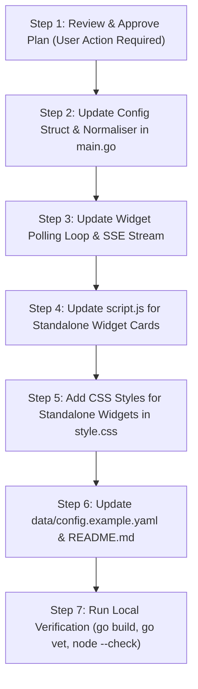

# Architectural Plan: Standalone Top-Level Widgets Configuration

**Project:** Simple Dash (`BuzzMoody/Simple-Dash`)  
**Feature Name:** Decoupled Standalone Widgets Configuration  
**Target Files:** `main.go`, `static/script.js`, `static/style.css`, `data/config.example.yaml`, `README.md`  
**Compliance Standard:** `AGENTS.md` (Rules 1–17)  
**Language Standard:** Australian English  

---

## Executive Summary & Rationale

Currently, API widgets in Simple Dash are tied directly to entries inside the `services:` YAML array in `config.yaml`. While this works well for services with direct status endpoints (e.g. Pi-hole or Proxmox), it limits flexibility when users want widgets that do not correspond to a hosted service link—such as hardware system metrics (`sys_metrics`), multi-endpoint ping monitors (`ping`), weather widgets, or standalone container aggregators.

This proposal decouples widgets into a top-level `widgets:` configuration block in `config.yaml`. Standalone widgets will have their own independent titles, icons/logos, URLs, authentication, settings, and refresh intervals. 

To satisfy **Rule 5 (Config Backward-Compatibility)**, legacy nested `widget:` blocks under `services:` will continue to be fully supported without breaking existing user configurations.

---

## Proposed Configuration Schema (`config.yaml`)

```yaml
header: "Homelab"
description: "My personal server dashboard"

# NEW: Top-level Standalone Widgets Array
widgets:
  - name: "Network Ping"
    type: "ping"
    icon: "⚡"
    refresh_interval: 15
    settings:
      endpoints: "Cloudflare:1.1.1.1, Google DNS:8.8.8.8, CS2 EU:203.0.113.5:27015"
      timeout: "2s"

  - name: "Pi-hole Statistics"
    type: "pihole"
    logo: "pi-hole.svg"
    url: "http://192.168.1.10/admin/api.php"
    refresh_interval: 30
    auth:
      key: "your_secret_api_key_here"

  - name: "Host System Metrics"
    type: "sys_metrics"
    icon: "💻"
    refresh_interval: 10

# Existing Services Array (Kept clean & concise)
services:
  - name: "Plex"
    url: "http://10.0.0.5:32400"
    category: "Media"
    logo: "plex.svg"
    description: "Main media streaming server"

  # Legacy nested widget syntax remains 100% backward-compatible:
  - name: "Proxmox VE"
    url: "https://192.168.1.100:8006"
    category: "Infrastructure"
    logo: "proxmox.svg"
    widget:
      type: "proxmox"
      url: "https://192.168.1.100:8006/api2/json"
      auth:
        user: "root@pam!dash"
        token: "xxxxxxxx-xxxx-xxxx-xxxx-xxxxxxxxxxxx"
```

---

## Detailed Code & Component Plan

### 1. Backend Data Structures & Parsing (`main.go`)

* Define `StandaloneWidgetConfig` struct:
  ```go
  type StandaloneWidgetConfig struct {
      ID              string            `json:"id"`
      Name            string            `yaml:"name" json:"name"`
      Type            string            `yaml:"type" json:"type"`
      URL             string            `yaml:"url" json:"-"`
      Icon            string            `yaml:"icon" json:"icon"`
      Logo            string            `yaml:"logo" json:"logo"`
      LogoDark        string            `yaml:"logo_dark" json:"logo_dark"`
      LogoLight       string            `yaml:"logo_light" json:"logo_light"`
      RefreshInterval int               `yaml:"refresh_interval" json:"refresh_interval"` // Seconds (min 5s)
      Auth            map[string]string `yaml:"auth" json:"-"`
      Settings        map[string]string `yaml:"settings" json:"settings"`
  }
  ```
* Update `Config` struct to include `Widgets []StandaloneWidgetConfig` (`yaml:"widgets" json:"widgets"`).
* **Backward-Compatibility Normalisation:**
  During configuration loading in `loadConfig()`, iterate over `Services`. If a service has a nested `widget:` block, automatically synthesise an internal `StandaloneWidgetConfig` entry using the service's `Name`, `Logo`, and `URL`, ensuring seamless backward compatibility without code duplication.

### 2. Widget Execution & Concurrency Engine (`main.go`)

* Implement `pollWidgets(ctx)` goroutine in `main.go`.
* **Bounded Concurrency & Intervals (Rule 1):**
  * Enforce a hard lower limit of 5 seconds on `refresh_interval` (defaulting to 30 seconds if omitted or invalid).
  * Use a bounded channel semaphore (`widgetSem := make(chan struct{}, 10)`) to restrict concurrent API calls across external widgets.
* **Server-Sent Events (SSE) Payload Integration:**
  * Standalone widget telemetry updates are pushed via SSE in the `widget_data` stream payload keyed by unique widget ID (e.g. `widget_standalone_<index>`).

### 3. Frontend Rendering Engine (`static/script.js`)

* **Dedicated Standalone Widget Container:**
  * Support rendering standalone widget cards directly inside the widget section without requiring a service card reference.
  * Populate widget header title, custom icons (`icon`), and theme-aware logos (`logo`, `logo_light`, `logo_dark`).
* **Metric Formatting & Animation (Rule 17):**
  * Pass incoming metric keys through `getWidgetMetricColours()` and `animateMetric()` to retain smooth slot-machine counter animations and flash effects.

### 4. GPU-Accelerated Layout & Styling (`static/style.css`)

* Add flexible grid layout styles for standalone widgets (`.standalone-widget-card`).
* Maintain glassmorphism design system using existing CSS variable tokens (`--glass-bg`, `--glass-border`, `--glass-blur`).
* Transitions strictly restricted to compositor-only CSS properties (`transform` and `opacity`) satisfying Rule 2.

---

## Impact & Security Assessment

### 1. Impact on Code Size
* **Go Compiled Binary:** ~+4.5 KB increase (struct definitions and normaliser loop).
* **Static Assets (JS/CSS):** ~+1.4 KB JavaScript, ~+600 Bytes CSS.
* **Configuration Overhead:** Minimal byte footprint in YAML parsing.

### 2. Impact on Performance
* **Polling Efficiency:** Dedicated polling loops allow independent refresh intervals per widget (e.g. `sys_metrics` every 10s, `ping` every 15s, `weather` every 30m).
* **Bounded Network Operations:** Enforces `widgetSem` semaphore (max 10 concurrent requests) and 3-second context deadlines per widget API fetch.
* **DOM Rendering:** Targeted DOM updates by widget ID avoid layout reflows during SSE streaming.

### 3. Impact on Security
* **Credential Isolation:** All `Auth` maps in `StandaloneWidgetConfig` are explicitly tagged with `json:"-"` to ensure tokens, passwords, and API keys are NEVER serialised into public SSE browser streams.
* **XSS Prevention:** Widget names, values, and titles rendered strictly via `textContent` and `setAttribute`.
* **Path Traversal Prevention:** Logo filenames validated with `filepath.Clean()` before serving assets from `/app/data/logos/`.

---

## Implementation & Verification Steps



### Verification Pipeline:
1. `go build` to verify zero Go compilation errors.
2. `go vet ./...` and `gofmt -w .` to verify backend code quality.
3. `node --check static/script.js` to verify frontend JavaScript syntax.
4. Update `README.md` and `data/config.example.yaml` to keep documentation in sync (Rule 4).
